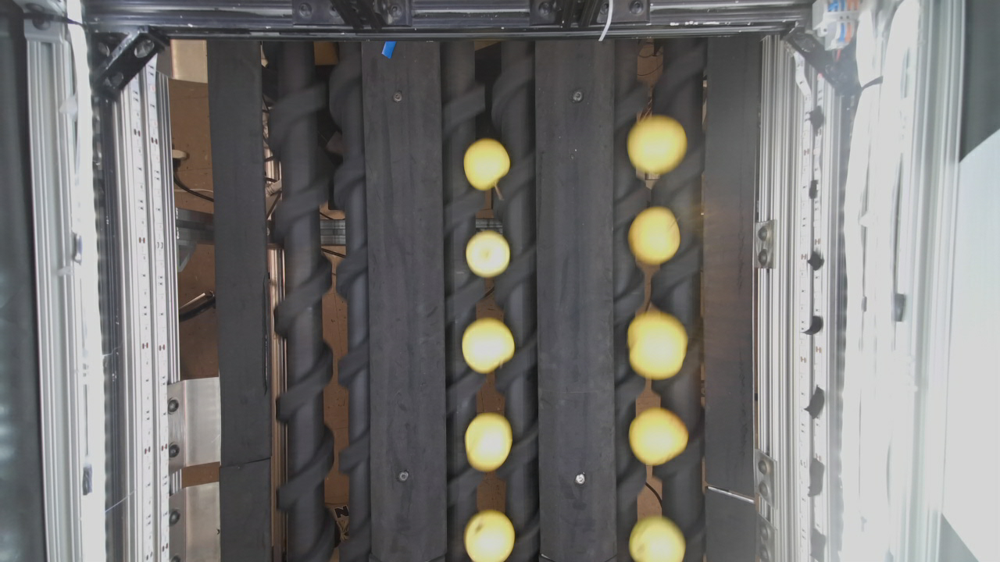

```python
DATASET_PATH = r"C:\Users\JmZha\VSCode_Project\Datasets\Apple"

```

<div style="text-align: center;">

</div>

```bash
requirement：
-  pip install opencv-python PyQt5 scipy pandas matplotlib

```